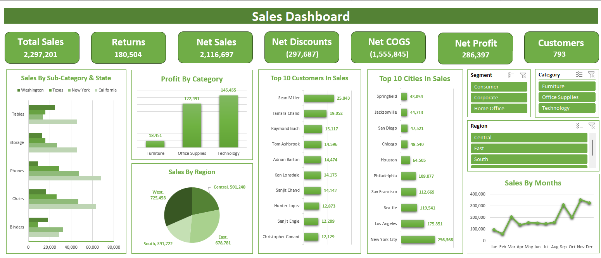

# 📊 Excel Sales Dashboard

## 📌 Overview

This project is an interactive Sales Dashboard built in Microsoft Excel using Power Query, Power Pivot, Pivot Tables, and Pivot Charts.

The dashboard provides valuable business insights by analyzing sales performance, customer behavior, regional sales, and monthly trends.

---
## 📂 Dataset

The original dataset used for this project is included in the `Dataset` folder.

The dataset contains sales-related information used for data cleaning, transformation, analysis, and dashboard development.

**Dataset file:** `Superstore_Dataset.xls`

---
## 📷 Dashboard Preview

---

## 🛠 Tools Used

- Microsoft Excel
- Power Query
- Power Pivot
- Pivot Tables
- Pivot Charts
- Data Cleaning
- Data Analysis
- Dashboard Design

---

## 📈 Dashboard Features

- Total Sales KPI
- Returns KPI
- Net Sales KPI
- Net Discounts KPI
- Net COGS KPI
- Net Profit KPI
- Customer Count
- Sales by Category
- Sales by Sub-Category
- Sales by Region
- Monthly Sales Trend
- Top 10 Customers
- Top 10 Cities
- Interactive Slicers

---

## 📂 Files

| File | Description |
|------|-------------|
| Sales.xlsx | Excel Dashboard |
| Sales.png | Dashboard Preview |

---

## 💡 Key Insights

- Analyze overall sales performance.
- Compare sales across different regions.
- Identify top-performing customers.
- Monitor monthly sales trends.
- Explore category performance.
- Filter dashboard dynamically using slicers.

---

## 👨‍💻 Author

**Amr Ramadan**

Electrical Engineer | Computer Engineering
